# Lab Management System (MSU FoTE · MCA)

A full-stack Lab Management System for the MSU Faculty of Technology (MCA).
Backend: .NET Web API + MongoDB. Frontend: React (Vite) + Tailwind. JWT authentication, role-based access (Teacher / Student), lab scheduling, attendance, submissions, grading, and in-app notifications.

Live Demo : https://labmanagementsystem-ccub.onrender.com

---

Key Features

- Role-based users: Teacher and Student
- Teacher:
	- Create labs (subject, start/end times, submission deadline)
	- View lab submissions, download files, grade & provide feedback
	- Manage labs
- Student:
	- Clock-in / Clock-out for attendance during lab hours
	- Upload submissions (multipart/form-data)
	- View own submission status, marks & feedback (read-only)
- Notifications:
	- Per-student notifications when teacher creates a lab (fallback broadcast)
	- Background worker sends "starting soon" and "lab ended" notifications (deduped)
	- Read / mark-all-read endpoints and frontend integration (Navbar)
- Reports:
	- Teacher dashboard with pending submission counts and per-lab summary
- File handling: upload, store and download (FileHelper + streaming)
- Swagger/OpenAPI for API exploration and testing
- Static React build served from backend (wwwroot) for single-URL deployment

---
## 📸 Live Demo

| 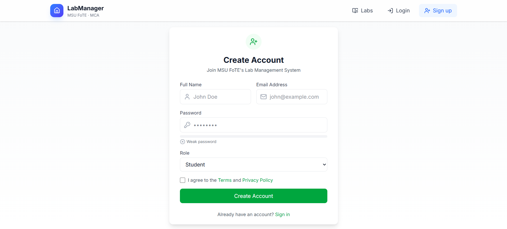 | 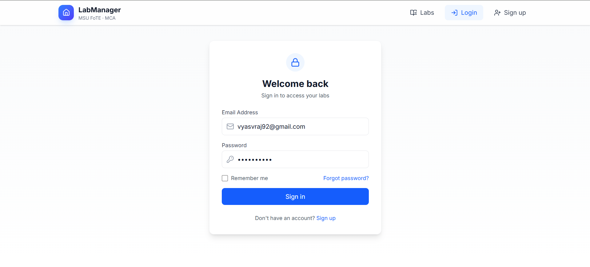 | 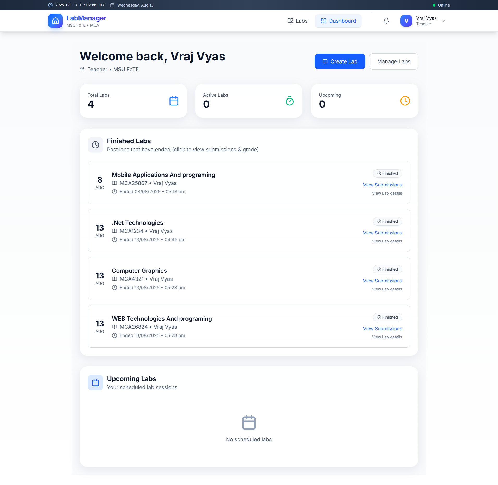 |
|-----------------------------|-----------------------------|-----------------------------|
| 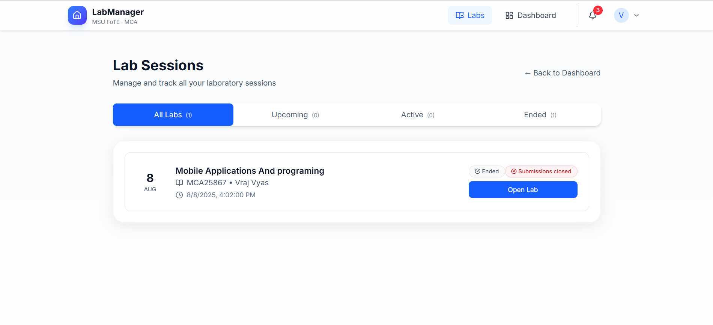 | 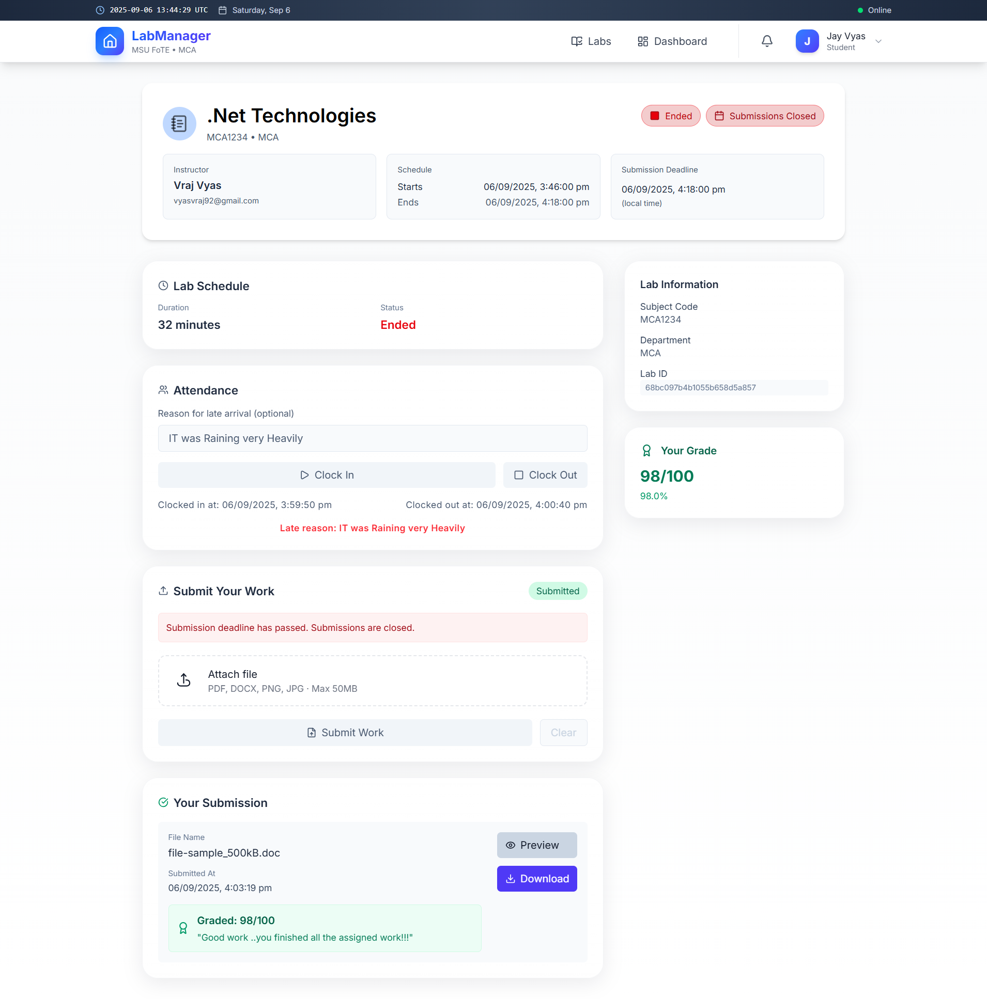 | 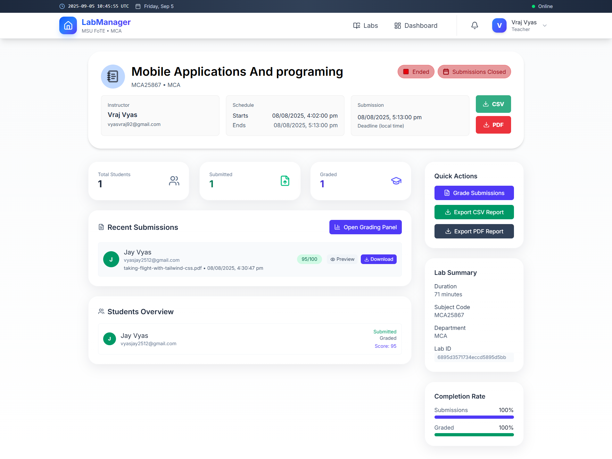 |
| 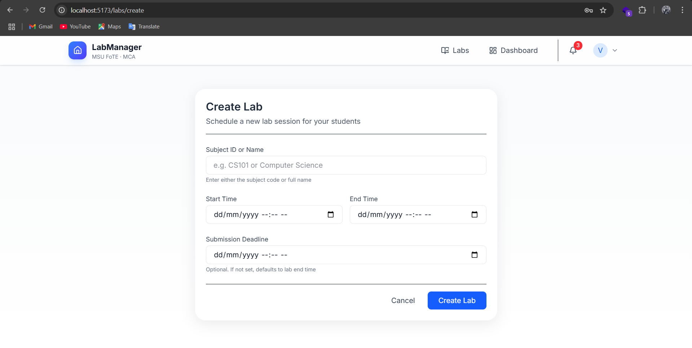 | 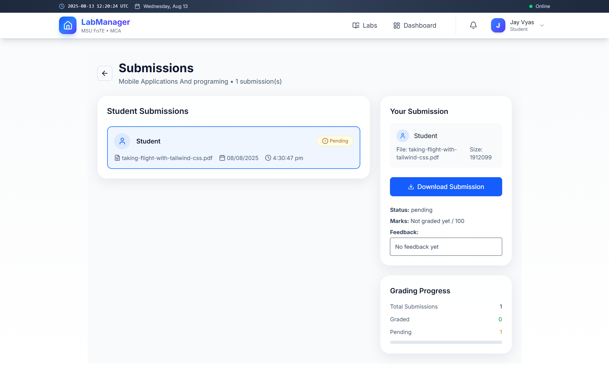 | 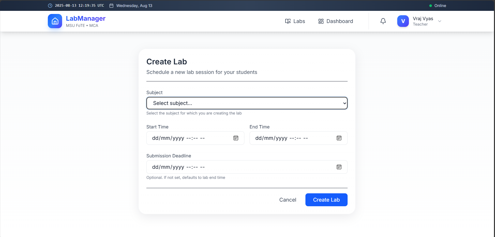 |
| 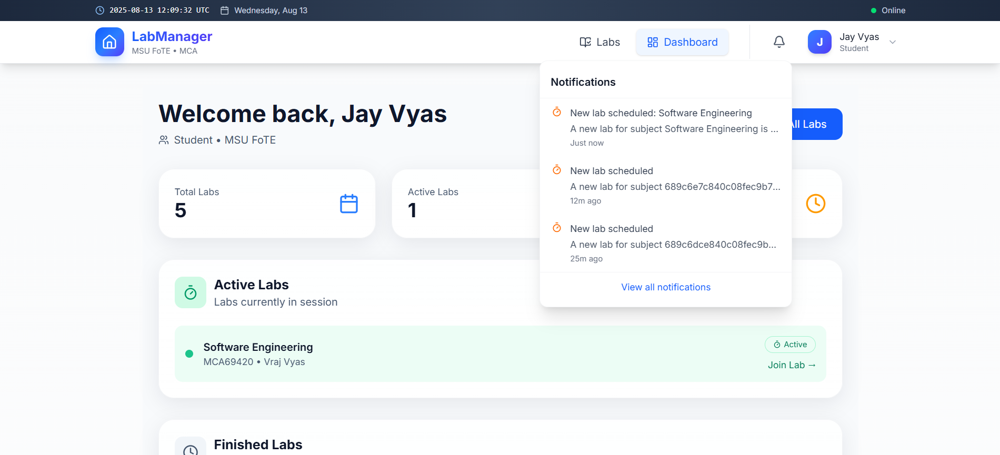 | 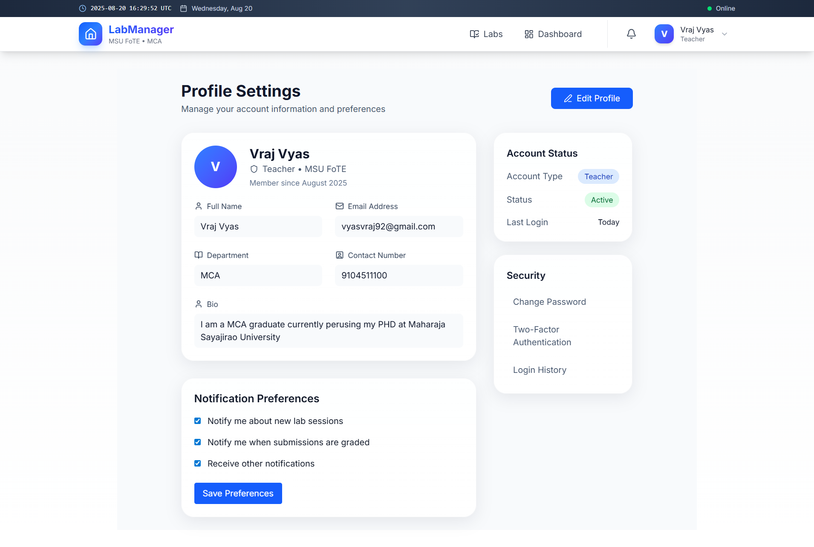 | 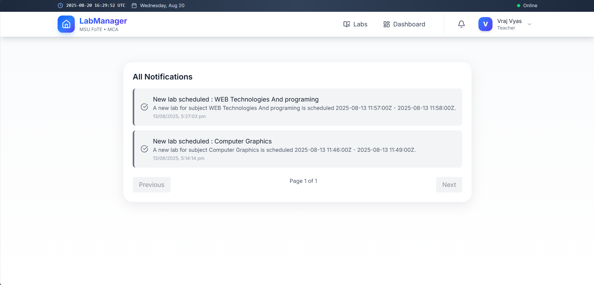 |

---

Tech Stack

- Backend: .NET 7 Web API
- Database: MongoDB
- Auth: JWT
- Frontend: React (Vite) + Tailwind CSS
- API Docs: Swagger (Swashbuckle)
- Background jobs: .NET HostedService (Lab reminder/ended notifications)

---

Prerequisites

- .NET 7 SDK
- MongoDB (local or Atlas)
- Node.js + npm (for frontend dev/build)
- Optional: Postman / HTTP client

---

Quickstart — Backend

1. 

Clone repository

	git clone https://github.com/yourorg/lab-management.git
	cd lab-management

2. 
Configure appsettings.json (example)

	{
	  "MongoDbSettings": {
	    "ConnectionString": "mongodb://localhost:27017",
	    "DatabaseName": "LabManagementDb"
	  },
	  "JwtSettings": {
	    "SecretKey": "replace_with_a_long_random_secret",
	    "Issuer": "LabManagementAPI",
	    "Audience": "LabManagementClient",
	    "ExpiryMinutes": 1440
	  },
	  "AllowedHosts": "*"
	}

	- Use environment variables or user secrets in development; never commit secrets.
3. 
Restore & build

	dotnet restore
	dotnet build

4. 
Run

	dotnet run

	- API will be available at http://localhost:5036 (or port shown in logs).
	- Swagger: http://localhost:5036/swagger

---

Quickstart — Frontend (development)

1. From frontend directory:

	cd web   # adjust path to your React app
	npm install
	npm run dev

2. For production build:

	npm run build
	# copy the build output to backend/wwwroot or configure deployment pipeline

---

Configuration Notes

- api client (frontend) uses request(path, opts) and relative URLs by default (.e.g request('/api/labs')). You may switch to a named BASE_HOST variable if deploying frontend and backend on different hosts.
- See src/api.js for all frontend routes and defensive checks (e.g. getSubmissions/labId validation, getMySubmission for students).

---

Important API Endpoints (summary)

Authentication

- POST /api/auth/register — register user
- POST /api/auth/login — login (returns JWT)
Users

- GET /api/users/me — get current profile
- PUT /api/users/me — update profile (name, department, contact, bio)
- GET /api/users — list users (Teacher only)
Subjects

- GET /api/subjects — list subjects (used by Create Lab dropdown)
Labs

- POST /api/labs — create lab (Teacher only)
- GET /api/labs — list aggregated labs (subject + teacher embedded)
- GET /api/labs/{id} — aggregated lab by id
Attendance

- POST /api/attendance/clockin — student clock-in
- POST /api/attendance/clockout — student clock-out
- GET /api/attendance/report/{labId} — attendance report (Teacher)
Submissions

- POST /api/submissions — Upload submission (Student, multipart/form-data)
- GET /api/submissions/lab/{labId} — list submissions for a lab (Teacher)
- GET /api/submissions/student/{studentId} — submissions by student
- GET /api/submissions/my?labId={labId} — student's own submission for a lab
- POST /api/submissions/{submissionId}/grade — grade submission (Teacher only)
- GET /api/submissions/{id}/download — download submission (streams file)
Notifications

- GET /api/notifications — list notifications for current user (includes broadcast)
- POST /api/notifications/{id}/read — mark as read
- POST /api/notifications/read-all — mark all read
- DELETE /api/notifications/{id} — delete notification
Reports

- GET /api/reports/teacher/dashboard — teacher dashboard summary
- GET /api/reports/lab/{labId} — lab analytics (if implemented)
- GET /api/reports/student/{studentId} — student analytics (if implemented)
Settings

- GET/PUT /api/settings
- Notification preferences: GET/PUT /api/notification-preferences

---

Notifications — how they work

- On lab creation:
	- Backend looks up subject name (via SubjectService) and enrolled students (User.SubjectIds).
	- Creates per-student Notification documents; if no students found, creates a broadcast Notification.
- Background worker (LabReminderBackgroundService):
	- Periodically checks labs and creates:
		- "Starting soon" reminder (configurable minutes before start)
		- "Lab ended" notification when end time passes
	- Uses NotificationService.ExistsAsync(...) to avoid duplicates.
- Frontend polls GET /api/notifications and displays unread counts in Navbar; clicking a notification marks it read and navigates to the relevant entity.

---

File storage (uploads/downloads)

- Submission files stored by FileHelper (server):
	- SaveFileAsync(IFormFile) — saves to server storage (e.g. wwwroot/uploads) and returns a file URL
	- DeleteFile(fileUrl) — deletes file from storage
	- GetFileStream(fileUrl) — returns stream for download endpoint
- Download endpoint streams file with proper Authorization checks.

---

Security & Best Practices

- Server-side authorization is authoritative. Keep [Authorize(Roles = "Teacher")] on grading endpoints.
- Use environment secrets for JWT keys and DB connection strings in production.
- Limit upload size and types in controllers (RequestFormLimits and size checks).
- Sanitize user inputs and validate DTOs (e.g., CreateLabDto validation).
- Use HTTPS in production and configure proper CORS policies.

---

Development tips & suggestions (improvements)

- Add SignalR for real-time notifications (removes polling).
- Add email/SMS notification delivery pipeline (use Notification documents as queue).
- Add a searchable/paginated notifications endpoint and a notifications center UI.
- Add admin UI for subject management and student enrollment (useful for per-subject notifications).
- Add audit logging and monitoring (Serilog + Seq / ELK).
- Add E2E tests for critical flows (login, create lab, submit, grade).
- Add role management UI and multi-tenant features if needed.

---

Troubleshooting

- If notifications collection is empty after creating labs:
	- Ensure logged-in teacher is creating lab
	- Ensure students have SubjectIds containing created subject id (otherwise broadcast created instead)
	- Check backend logs for exceptions from NotificationService
- If attendance endpoints 500:
	- Confirm Lab documents are not malformed (use ReplaceOneAsync for updates)
	- Check timezone handling when comparing UTC dates (server uses UTC in checks)
- If frontend requests /api/... return 404/500:
	- Verify backend is running and CORS configured for frontend origin
	- Verify JWT token present in localStorage (key token) for protected endpoints

---

Contributing

1. Fork the repo
2. Create a branch: git checkout -b feat/your-feature
3. Commit changes and push: git push origin feat/your-feature
4. Open a pull request with a clear description

---
Thank you for viewing my project
