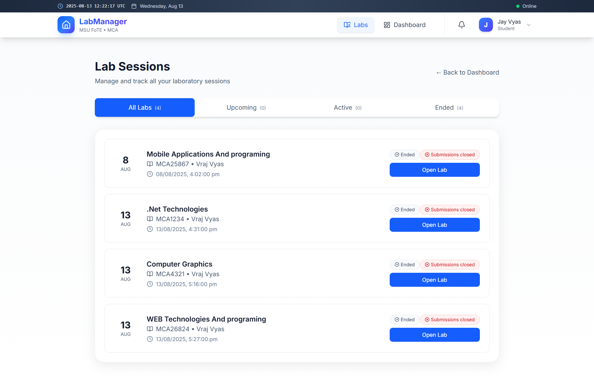
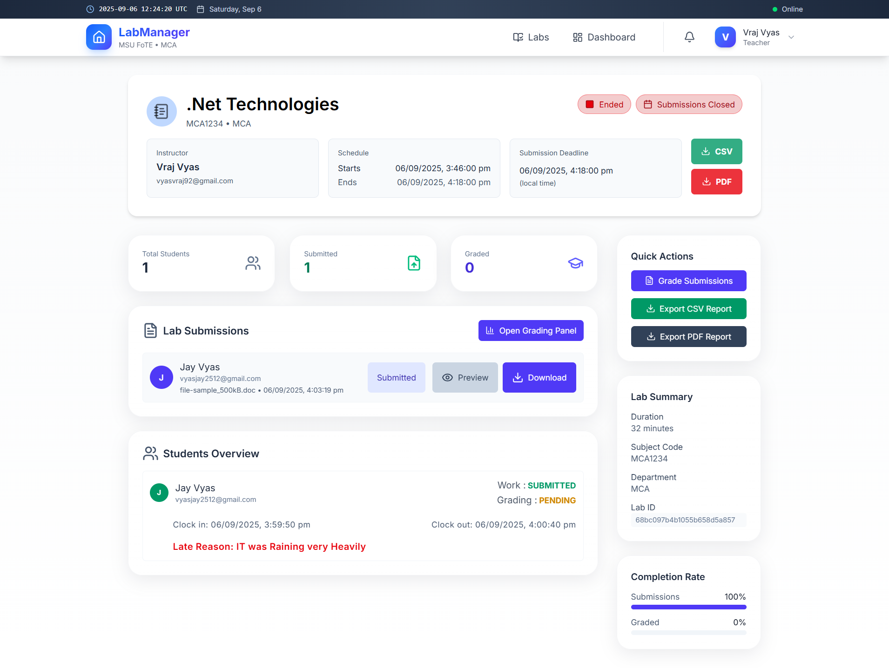
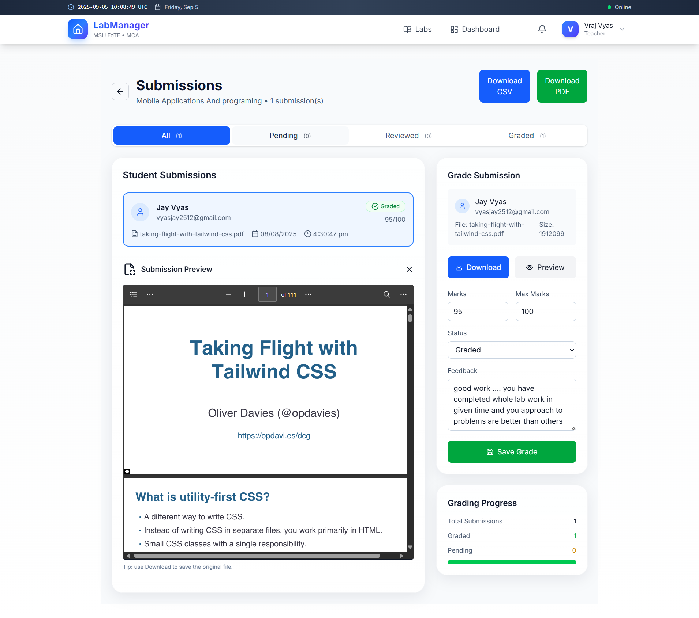

# Lab Management System (MSU FoTE · MCA)

[](https://dotnet.microsoft.com/download/dotnet/8.0)
[](https://reactjs.org/)
[](https://www.mongodb.com/)
[](https://tailwindcss.com/)
[](https://jwt.io/)
[](https://vitejs.dev/)

A comprehensive full-stack Laboratory Management System designed specifically for MSU Faculty of Technology (MCA) that revolutionizes lab management through digital transformation. This system streamlines critical academic processes including lab scheduling, attendance tracking, submission management, grading, and real-time notifications.

🔗 **Live Demo:** [https://labmanagementsystem-ccub.onrender.com](https://labmanagementsystem-ccub.onrender.com)

## 🎯 Project Overview

The Lab Management System is built with modern technologies and best practices:

- **Backend**: Robust **.NET 8 Web API** with clean architecture
- **Database**: Scalable **MongoDB** for flexible data storage
- **Frontend**: Modern **React (Vite)** with **Tailwind CSS** for responsive UI
- **Security**: **JWT-based authentication** with role-based access control
- **Storage**: Cloud-based file management using **Cloudinary**
- **Real-time**: **SignalR** for instant notifications and updates

## 📸 Screenshots

|  |  |  |
|-----------------------------|-----------------------------|-----------------------------|
|  |  |  |
|  |  |  |
|  |  |  |


## ✨ Key Features

### 👩‍🏫 Teacher Features
- **Lab Management**
  - Create and schedule lab sessions
  - Set submission deadlines
  - Define lab requirements and instructions
  - Monitor real-time attendance
  
- **Submission Handling**
  - View and download student submissions
  - Grade assignments with detailed feedback
  - Track submission status and deadlines
  
- **Analytics Dashboard**
  - View pending submission counts
  - Access lab-wise performance metrics
  - Generate attendance reports

### 👨‍🎓 Student Features
- **Lab Participation**
  - Digital attendance through clock in/out
  - Real-time lab schedule viewing
  - Submission status tracking

- **Assignment Management**
  - Upload submissions securely
  - View grades and feedback
  - Track submission history

### 🔔 Smart Notifications
- Real-time alerts via SignalR
- Lab start/end reminders
- Submission deadline notifications
- Grade posting alerts
- Custom notification preferences

## 🛠️ Technical Architecture

### Backend Components
```
LabManagement.API/
├── Controllers/
├── Services/
├── Models/
├── DTOs/
├── Middleware/
└── Background/
    └── NotificationWorker
```

### Frontend Structure
```
src/
├── components/
├── pages/
├── services/
├── hooks/
├── context/
└── utils/
```

## 🌐 API Endpoints Reference

### 🔑 Authentication
```
POST /api/auth/register      - Register new user
POST /api/auth/login         - Login and get JWT token
```

### 👥 Users
```
GET    /api/users/me         - Get current user profile
PUT    /api/users/me         - Update current user profile
GET    /api/users            - List all users (Teacher only)
GET    /api/users/me/stats   - Get user statistics
```

### 📚 Subjects
```
GET    /api/subjects         - List all subjects
```

### 🏛️ Labs
```
POST   /api/labs            - Create new lab (Teacher only)
GET    /api/labs            - List all labs
GET    /api/labs/{id}       - Get lab details
PUT    /api/labs/{id}       - Update lab (Teacher only)
DELETE /api/labs/{id}       - Delete lab (Teacher only)
```

### ✍️ Submissions
```
POST   /api/submissions                         - Upload submission (Student)
GET    /api/submissions/lab/{labId}            - Get lab submissions (Teacher)
GET    /api/submissions/student/{studentId}     - Get student submissions
GET    /api/submissions/my?labId={labId}       - Get my submission for lab
POST   /api/submissions/{id}/grade             - Grade submission (Teacher)
GET    /api/submissions/{id}/download          - Download submission file
```

### ⏰ Attendance
```
POST   /api/attendance/clockin                - Clock in for lab
POST   /api/attendance/clockout               - Clock out from lab
GET    /api/attendance/my/{labId}            - Get my attendance for lab
GET    /api/attendance/report/{labId}        - Get lab attendance report (Teacher)
```

### 🔔 Notifications
```
GET    /api/notifications                    - Get user notifications
POST   /api/notifications/{id}/read          - Mark notification as read
POST   /api/notifications/read-all          - Mark all notifications as read
DELETE /api/notifications/{id}              - Delete notification
GET    /api/notifications/all               - Get paginated notifications
GET    /api/notification-preferences        - Get notification preferences
PUT    /api/notification-preferences        - Update notification preferences
```

### 📊 Reports
```
GET    /api/reports/teacher/dashboard       - Get teacher dashboard stats
GET    /api/reports/lab/{id}               - Get lab analytics
GET    /api/reports/student/{id}           - Get student analytics
```

### ⚙️ Settings
```
GET    /api/settings                       - Get system settings
PUT    /api/settings                       - Update system settings
```

### 🔒 Authentication & Authorization

- Most endpoints require a valid JWT token in the `Authorization: Bearer {token}` header
- Role-based access control:
  - `Teacher` roles can access all endpoints
  - `Student` roles have limited access to specific endpoints
  - Some endpoints (like registration) are public
- File operations have additional security:
  - Upload size limits (20MB)
  - File type validation
  - Secure download URLs with token validation

### 📡 Response Formats

**Success Response:**
```json
{
  "data": {
    // Response data
  },
  "message": "Optional success message"
}
```

**Error Response:**
```json
{
  "message": "Error description",
  "detail": "Optional technical details"
}
```

### 📝 Common Query Parameters

- **Pagination:**
  - `page` - Page number (default: 1)
  - `pageSize` - Items per page (default: 20, max: 100)

- **Filtering:**
  - `labId` - Filter by lab
  - `studentId` - Filter by student
  - `status` - Filter by status

### 🔄 Rate Limiting

- API requests are rate-limited to prevent abuse
- Limits vary by endpoint and user role
- Response headers include rate limit info:
  - `X-RateLimit-Limit`
  - `X-RateLimit-Remaining`
  - `X-RateLimit-Reset`

## 🚀 Installation & Setup

### Prerequisites
- .NET 8 SDK
- Node.js 16+
- MongoDB 5.0+
- Cloudinary Account

### Backend Setup
```bash
# Clone repository
git clone https://github.com/VrajVyas11/LabManagementSystem.git
cd LabManagementSystem

# Restore dependencies
dotnet restore

# Update appsettings.json
# Start the API
dotnet run
```

### Frontend Setup
```bash
# Navigate to frontend
cd web

# Install dependencies
npm install

# Start development server
npm run dev
```

## 💾 Database Schema

### Collections
- Users
- Labs
- Submissions
- Attendance
- Notifications
- NotificationPreferences

## 🔐 Security Features

- JWT-based authentication
- Role-based access control (RBAC)
- Secure file uploads
- Input validation
- CORS protection
- Rate limiting

## 📊 API Documentation

Comprehensive API documentation is available through Swagger UI at `/swagger` when running locally.

## 🔄 Development Workflow

1. Feature branches from `main`
2. Pull request review process
3. CI/CD pipeline validation
4. Merge to `main` upon approval

## 📈 Future Enhancements

- [ ] Advanced analytics dashboard
- [ ] Email/SMS notifications
- [ ] Mobile application
- [ ] Offline support
- [ ] Integration with LMS platforms
- [ ] AI-powered plagiarism detection

## 🐛 Troubleshooting

Common issues and solutions are documented in our [Wiki](https://github.com/VrajVyas11/LabManagementSystem/wiki).

## 🤝 Contributing

Contributions are welcome! Please read our [Contributing Guidelines](CONTRIBUTING.md) first.

## 📄 License

This project is licensed under the MIT License - see the [LICENSE](LICENSE) file for details.

## 👏 Acknowledgments

- MSU Faculty of Technology (MCA)
- All contributors and testers
- Open source community

---

<p align="center">Made with ❤️ for MSU FoTE MCA</p>
